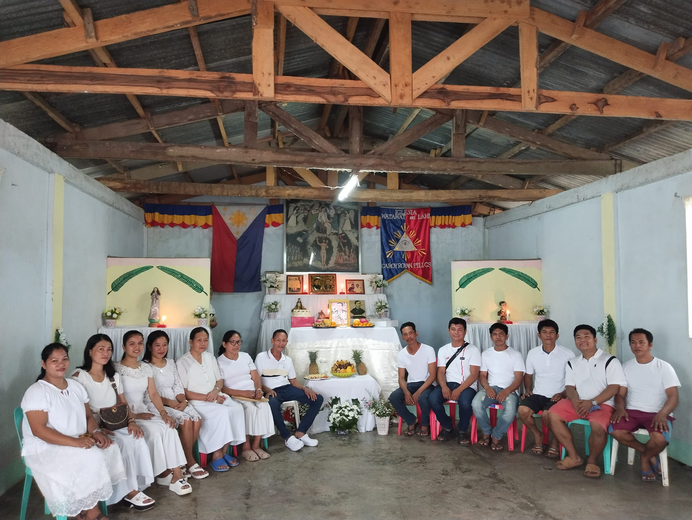

# Iglesia Watawat ng Lahi

Image taken from <a href="https://www.facebook.com/photo/?fbid=998610915638452&set=pb.100064686580389.-2207520000">here</a>.

## Beliefs

The Iglesia Watawat Ng Lahi, incorporates the teachings of Christianity and
Philippine Nationalism through the works of Rizal. They make use
of the novels of Rizal, Noli me Tangere, and El Filibusterismo as their primary
text alongside the bible which comes as secondary. They believe that José Rizal
will emerge from Mount Makiling at the end of the world to liberate the
Philippines which parallels the Christian teaching of the Second Coming of
Jesus Christ. 

1. The power of the Father was given to Moses; the power of the Son,
   given to Jesus Christ; and the power of the Holy Ghost is given
to Jose Rizal.
2. Rizal is not dead; he is alive and is physically and materailly present in the New Jerusalem
which is presently hidden in the site extending from Mt. Makiling to Mt. Banahaw
3. It is the voice of Rizal which commands the officials and the
   members what to do. A specific person named Gaudioso Parabuac, is
needed to ask Rizal to come and talk to the members
4. If the third world ware breaks out, Dr. Rizal will make an appearance to the
   new world, and he will lead the army of God.
5. Man has a soul, but a soul that is different from the soul of Dr. Rizal, for Rizal is god.
6. Three days after a person's death, and if he was holy in life,
   that person will rise again and his soul will proceed to the New
   Jerusalem. If not, his soul is will be made to work in a place
   opposite the New Jerusalem.

## Rituals

The church of this sect is found in Lecheria, Calamba, Laguna. The
church closely resembles the appearance of a Catholic church. But
instead of a main alter having an image of Jesus Christ, this is
replaced by a bigger statue of Rizal with a winged angel hovering
around him.

## Sacraments

1. Confirmation is performed by the Supreme Bishop and other bishops of the sect
2. Matrimony is perfomred according to rites simlar to those of the
   Catholic faith. The same thing is true of extreme unction

The members of this sect however do not practice communions nor confessions.

