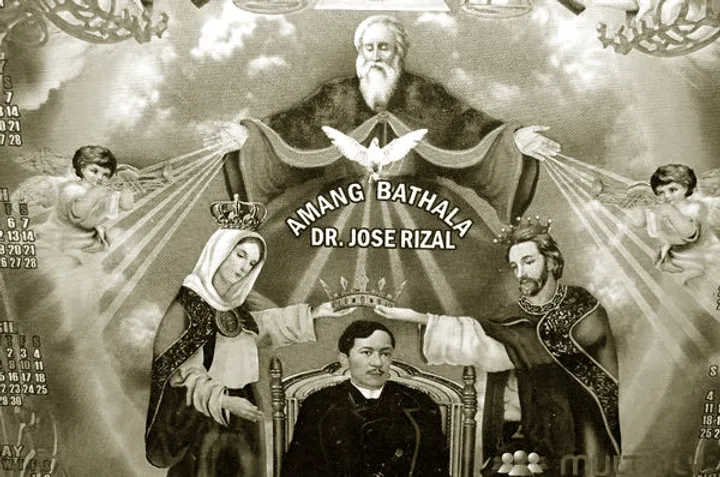

# Rizalista Movements

Image taken from <a href="https://tagacalamba.wixsite.com/calamba/single-post/2016/01/04/culture-rizalistas">here</a>.

We present the following religious movements that worship Rizal which is primarily based on 
the information from the work[^1] of Dr. Marcelino Fronda Jr. 

1. [Adarnistas](./adarnistas.md)
2. [Bathalismo](./bathalismo.md)
3. [Sambahang Rizal](./sambahang-rizal.md)
4. [Iglesia Watawat ng Lahi](./iglesia-watawat-ng-lahi.md)

# References

[^1]: Foronda, M. A., Jr. (n.d.). Cults Honoring Rizal. Retrieved from
https://joserizallifeandworks.wordpress.com/wp-content/uploads/2019/03/13-foronda_cults-honoring-rizal.pdf
