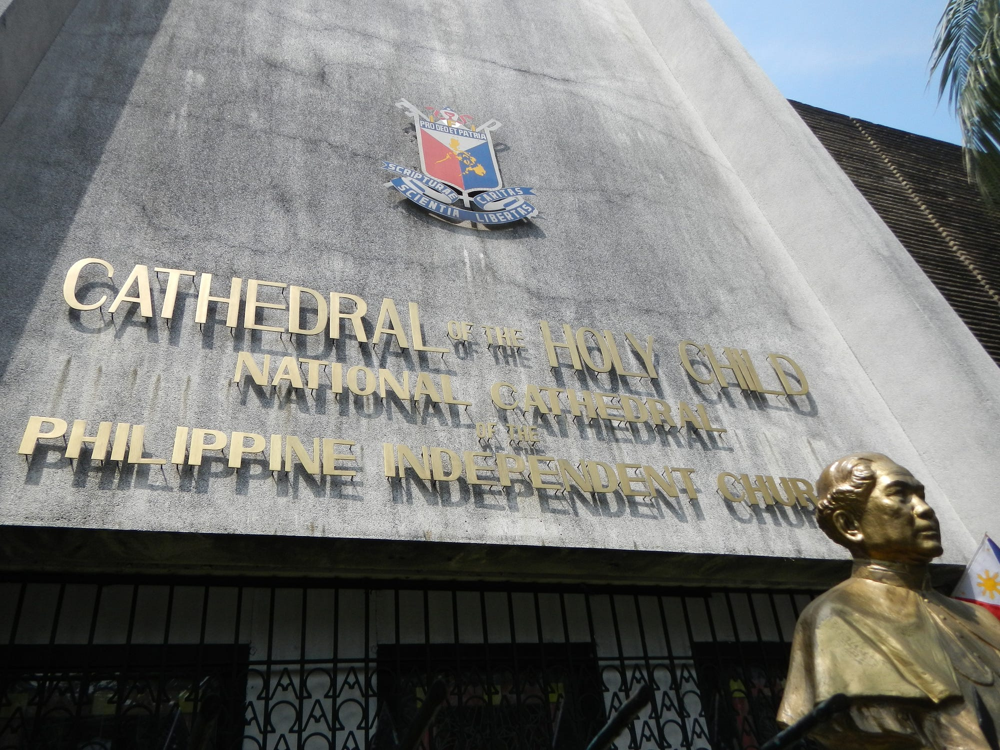

::: info NOTE
Most of the contents of this page (and website in general) is from the study of
Dr. Marcelino A. Foronda Jr entitled **Cults Honorizing Rizal** [^1].
:::

# Introduction

Jose Rizal is one of the most prominent figures in Philippine history. Regarded
as a National Hero, he is considered by many to be indispensable in the
country’s fight against Spanish colonization. However, Rizal's legacy has
not been without controversy. Over the years, his life and works have been
co-opted by various religious movements, elevating him to an almost mythical or
divine status.

# Origins of the First Rizalista Movements

According to a study by Dr. Marcelino A. Foronda Jr., it is challenging to
pinpoint the first instance of a religious movement worshipping Rizal [^1].
However, he hypothesizes that this may have begun when the Philippine
Independent Church (PIC) canonized Dr. José Rizal as a saint on September 24,
1903, alongside José Burgos, Mariano Gómez, and Jacinto Zamora [^2].

    

    Image taken from <a href="https://upload.wikimedia.org/wikipedia/commons/2/23/PhilippineIndependentChurchjf0264_01.JPG">here</a>.
    

The Philippine Independent Church, established in 1902, emerged from the
Filipino struggle for independence, seeking freedom from both colonial rule and
the dominance of the Spanish Catholic Church [^3]. It is a Christian
Denomination, which might explain why most Religious Movements that venerate
Rizal borrows concepts from Christianity.

The canonization of Rizal was a significant event for the PIC and its members.
Images and statues of Rizal were prominently displayed in its churches and
chapels, providing devotees with a place to honor and worship him [^2].

As a newly canonized saint, a cult dedicated to Rizal emerged within the
Philippine Independent Church. Novenas were written in his honor, his statues
were given a place of reverence in the church's chapels, his feast days were
celebrated with religious ceremonies, and his name was often chosen for
baptisms. 

However, according to then present Supreme Bishop of the sect, Mons. Isabelo de
los Reyes, Rizal's canonization was an expression of the "intensely
nationalistic phase" development of the PIC. A phase in which he described as a
thing of the past. But this did not deter other religious movements to venerate
Rizal, not only as a a saint but as a god.  

Dr. Foronda Jr. noted that as early as 1932, Katherine Mayo observed a cult
built around Rizal in Surigao fueld with the hope from a tale highlighting the
imminence of a war that will soon first break in Surigao.

> *"Then, after four months of fighting, Dr. Jose Rizal would arrive... in a large
> ship. In this shop he would embark all the faithful and would carry them
> triumphantly away to the island of Cebu. There they would celeberate victory
> in company of the Holy Child."*

He further emphasized that as late as 1959, Fr. Richard Arens has also mentioned that the "Pulahanes of
Camp Minarog in (Wright, Samar)" believed that Rizal would return to life and
that there would be a time when rich and poor would be alike.

> *"Many towns of Leyte among them Dulag, Burauen, and Limon have
> religious sects called Banal which venerate Rizal as a god. They have chapels
> where they pray on their knees before the hero's picture or statue.*
> 
> *Legaspi City, too, has a strange society caled Pantay-pantay whose members are called
> Rizalinos. Periodically the members walk barefoot i n a procession to Rizal's
> monument and hold a queer sort of a mass. Usually this procession is done on
> Rizal Day (December 30) or on June 1 9 , the natal day of the hero.*
> 
> *Some 'colorum' sects also venerate Rizal as a god. A 'colorum' sect in
> Tayabas, Quezon has built a chapel for him at the foot of Bundok San
> Cristobal, better known as Mt. Banahaw"*
>   - Paulina Carolina Malay

# References

<!-- some context on why people worship other people, what made Rizal be this person? -->

[^1]: Foronda, M. A., Jr. (n.d.). Cults Honoring Rizal. Retrieved from
https://joserizallifeandworks.wordpress.com/wp-content/uploads/2019/03/13-foronda_cults-honoring-rizal.pdf

[^2]: José Rizal: A Hero-Saint? (2012, September 19). Retrieved December 21, 2024,
from https://nhcp.gov.ph/jose-rizal-a-hero-saint/

[^3]: Philippine Independent Church. (1958). World Council of Churches.
https://www.oikoumene.org/member-churches/philippine-independent-church
